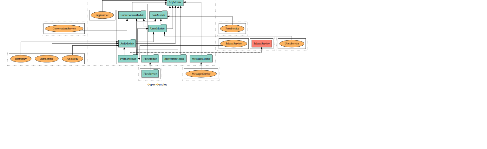

[<div align="center" style="display:flex; justify-content:center; text-align:center">
<h1 style="color:#E0234E;">Teneno API</h1><p style="color:purple;"><em>A official api for teneno application</em></p></div>](public/logo.svg)

[](https://dev.to/thuongtruong1009)
[](https://github.com/thuongtruong1009)
[](mailto:ititiu19228@student.hcmiu.edu.vn)
[](https://linkedin.com/in/thuongtruong1009)
## Preview

* [Frontend connect](https://github.com/thuongtruong1009/teneno)

<!-- * [API document](http://localhost:5500/api) -->

* [Project documentation](https://thuongtruong1009.github.io/teneno-api)

* [Database diagram](https://dbdiagram.io/d/62fe42dec2d9cf52fad1848c)

## Description

* The purpose of Teneno webapp is create a new network platform where everyone can sharing their feels, thinks or experiences together
* Make an easily life with Teneno
* Practice Backend skills and improve programming thinking

## Features

| **Admin** | **Auth** |
| --- | ---|
| ✅ Get list all users | ✅ Signup |
| ✅ Get user profile by id | ✅ Signin |
| ✅ Update user profile | ✅ Signout  |
| ✅ Delete user by user-id | ✅ Refresh access-token |
|  | ✅  Update password |

| **OAuth** | **Files** |
| --- | --- |
| ✅ Google signin | ✅ Upload single file (avatar, cover) |
| ✅ Facebook signin | ✅ Upload multi files |
| ✅ Github signin | ✅ Upload array-field files (post, sample_image) |

| **Users** | **Posts** |
| ---| --- |
| ✅ Get public user by user-id or username  | ✅ Create a new post |
| ✅ Find user account by email | ✅ Get all posts of user by user-id |
| ✅ Get user profile by id | ✅ Match a new category with new post |
| ✅ Update user profile | ✅ Get a post by post-id |
| ✅ Delete user-profile by email & password | ✅ Delete a post by post-id |
|  | ✅ Reaction to post |
|  | ✅ Get all comments of post |
|  | ✅ Add a new comment to post |
|  | ✅ Update a comment of post |
|  | ✅ Delete a comment of post |

| **Conversations** | **Chats** |
| ---| --- |
| ✅ Create new conversation | ✅ Join conversation by conversation-id |
| ✅ Get all conversations of user| ✅ Get all messages in conversation |
| ✅ Get one conversation information has current user | ✅ Create new messages |
| ✅ Update members to current conversation | ✅ Update message by message-id |
| ✅ Update conversation information (name, description, avatar) | ✅ Delete messages by message-id |
| ✅ Delete admin out of current conversation by creator |  |
| ✅ Delete conversation by creator |  |
| ✅ Change users role in current conversation |  |

<!-- | <ul><li>item1</li><li>item2</li></ul>| See the list | -->
<!-- ⬜️ ✅ -->

## Structure



## Plugins & Dependencies

* [Nodejs](http://nodejs.org) framework for building efficient and scalable server-side applications
* [Nest](https://github.com/nestjs/nest) framework TypeScript starter repository
* [Prisma](https://www.prisma.io/) query builder and auto-generated schema with types tailored
* [CORS](https://www.npmjs.com/package/cors) connect middleware that can be used to enable CORS with various options
* [Swagger](https://swagger.io/) describe definition format and design document APIs at scale
* [Bcrypt](https://www.npmjs.com/package/bcrypt) a library to help you hash passwords
* [JWT](https://www.npmjs.com/package/jsonwebtoken) decode, verify and generate access tokens
* [Class-validator](https://www.npmjs.com/package/class-validator) use of decorator and non-decorator to perform validation
* [Class-transformer](https://www.npmjs.com/package/class-transformer) transform plain object to some instance of class and versa and serialize / deserialize object based on criteria
* [Passport](https://www.npmjs.com/package/passport) compatible authentication requests middleware for Node.js
* [Cookies-Parser](https://anonystick.com/blog-developer/cookie-parser-la-gi-middleware-can-thiet-ma-hoa-cookie-trong-expressjs-2020112687915577) middleware parsing of cookies in Nodejs and Expressjs.
* [Multer](https://docs.nestjs.com/techniques/file-upload) upload file data form in Expressjs
* [Cookie-parser](https://www.npmjs.com/package/cookie-parser) Parse Cookie header and signed cookie support
* [Helmet](https://www.npmjs.com/package/helmet) secure Express apps by setting various HTTP headers
* [Compression](https://www.npmjs.com/package/compression) compress response bodies for all request
* [Read-Eval-Print-Loop (REPL)](https://docs.nestjs.com/recipes/repl) takes - executes single user inputs, and returns the result to the user, interactive environment, inspect dependency graph and call methods on providers - controllers directly from terminal
* [Serve Static](https://docs.nestjs.com/recipes/serve-static) serve static content like a Single Page Application (SPA)
* [Compodoc](https://docs.nestjs.com/recipes/documentation) Generate project documentation
* [Webpack hot-reload](https://docs.nestjs.com/recipes/hot-reload) auto recompile the entire project each time a change occurs
* [gRPC](https://docs.nestjs.com/microservices/grpc#grpc) support to run in any environment across data centers based on the concept of defining a service in terms of functions (methods) that called remotely

## Conventions & Tools

* [Prettier](https://prettier.io/) opinionated code formatter
* [Eslint](https://eslint.org/) analyzes code to quickly find problems and built with continuous integration pipeline
* [Husky x Lintstage x Commitlint](https://medium.com/angular-in-depth/husky-6-lint-prettier-eslint-and-commitlint-for-javascript-project-d7174d44735a) linter conventions for clean code
* [JWT Playground](https://jwt.io)

## References & Tips

* [Prisma x Nest](https://docs.nestjs.com/recipes/prisma#getting-started) build CRUD API endpoints rapidy
* [Fix upload file on Postman](https://stackoverflow.com/questions/60036239/upload-file-failed-postman)
* [File upload with Nest](https://notiz.dev/blog/type-safe-file-uploads)
* [Base roles example](https://www.youtube.com/watch?v=wdsp7BNmJRc&list=PL2eJaT2jJV7Ku72gl8YSSVRC0D7IQRJJZ&index=9&ab_channel=MariusEspejo)
* [Logger 1](https://viblo.asia/p/xay-dung-bo-logger-xu-ly-exception-tap-trung-trong-nestjs-ORNZq1qMZ0n)
* [Postgre x Heroku](https://dev.to/prisma/how-to-setup-a-free-postgresql-database-on-heroku-1dc1)
* [Nest x Prisma](https://docs.nestjs.com/recipes/prisma)
* [gRPC for Microservice](https://200lab.io/blog/grpc-la-gi-vu-khi-tang-tai-microservices/)

<!-- * [Database for chat](https://l.facebook.com/l.php?u=https%3A%2F%2Fwww.google.com%2Fsearch%3Fq%3Ddatabase%2Bfor%2Bchat%2Bapplication%26sxsrf%3DALiCzsZVJGO-Xg7f0j6bm04uemOFXQOCow%3A1661272422354%26source%3Dlnms%26tbm%3Disch%26sa%3DX%26ved%3D2ahUKEwjH3u-Est35AhUFmlYBHQe4BikQ_AUoAXoECAEQAw%26biw%3D1920%26bih%3D948%26dpr%3D1&h=AT1rz92_FbaMniK5W8han8NWXAfairaSKCmfkCu3TPLJWm48IqSIYii-aIRJ16hF-Vt_Y7Ju8l2B8YvIqo-5fIndTxa4Koo62fgJN7fGuUcbuMg9XU-5Y7IYHdhWjOESt9SEOvAGrud8_5c&s=1)
* [Database for social](https://l.facebook.com/l.php?u=https%3A%2F%2Fwww.google.com%2Fsearch%3Fq%3Ddatabase%2Bfor%2Bsocial%2Bmedia%2Bapp%26tbm%3Disch%26ved%3D2ahUKEwj2_M6Tst35AhUKVPUHHefeDpkQ2-cCegQIABAA%26oq%3Ddatabase%2Bfor%2Bsocial%2Bmedia%26gs_lcp%3DCgNpbWcQARgAMgQIABAYMgQIABAYOgQIIxAnOgYIABAeEAg6BQgAEIAEUN4HWOodYNYlaABwAHgAgAGFAYgB3AySAQQwLjE0mAEAoAEBqgELZ3dzLXdpei1pbWfAAQE%26sclient%3Dimg%26ei%3DhQEFY7amEIqo1e8P5727yAk%26bih%3D948%26biw%3D1920&h=AT2bN5utpmugfzrrq3LxJL2taNOV2GVjJPB9MXZ3kkPt5MBwUuqo6O-m-g_xeLO-c0MBe3_P6H_hrFvp53MmQ8msV1DFVay8_JdoXpgmkCp8LQwiiTzYktBVKIMNN_kEWLxUjRQLqsOIZyE&s=1) -->

## Example templates

* [Nest example](https://github.com/hantsy/nestjs-rest-sample)
* [Nest awesome](https://github.com/nestjs/awesome-nestjs)
* [Nest structure](https://github.com/CatsMiaow/nestjs-project-structure)
* [Nest auth example](https://github.com/leosuncin/nest-auth-example)
* [Nest social login](https://github.com/m-haecker/nestjs-social-login)

### Setup Prisma

```bash
# Installation
npm install prisma@latest @prisma/client
```

```bash
# Init prisma
npx prisma init

# turn database schema into a Prisma schema
npm run prisma:pull

# generate the Prisma Client
npm run prisma:generate

# Create env and migrate db
npm run prisma:migrate

# Sync migrate change to db
npm run prisma:push
```

```bash
# Open prisma studio
npm run prisma:studio
```

### Running with local

```bash
# Intall dependencies
$ npm install
```

```bash
# development
$ npm run start

# watch mode
$ npm run start:dev

# production mode
$ npm run start:prod
```

### Running with Docker
```bash
# Pull image
$ docker pull thuongtruong1009/teneno-api:latest
```

```bash
# Start container
$ docker-compose up
```

### Test

```bash
# unit tests
$ npm run test

# e2e tests
$ npm run test:e2e

# test coverage
$ npm run test:cov
```

## Support

Teneno is an MIT-licensed open source project. It can grow thanks to the sponsors and support by the amazing backers. If you'd like to join them, please [read more here](https://github.com/sponsors/thuongtruong1009).

## Stay in touch

-   Get idea inspiration: [bee-music](https://dribbble.com/shots/16618273-Bee-Music-Music-Media-Player-Dashboard?fbclid=IwAR35hkSSs2dB2Ek66GAX-yPDfx3JYxxJgeQdwweuEiEtne02IUYk13kxDnk)
-   Follow progresses at [latest project updated](https://github.com/thuongtruong1009/bee-music/projects)
-   Trading and shopping your style with [e-shopee](https://github.com/thuongtruong1009/e-shopee)
-   Enhance front-end skills through [twitter-meta](https://github.com/thuongtruong1009/twitter-meta)
-   Generate your GitHub informations by [gitbox](https://github.com/thuongtruong1009/gitbox)
-   Begining Vue through [notedev](https://github.com/thuongtruong1009/notedev)
-   Learning front-end web full course at [frontend-master](https://github.com/thuongtruong1009/frontend-master)
-   Learn Object-Oriented-Programming tutorial at [Snake-Game-OOP](https://github.com/thuongtruong1009/Snake-Game-OOP)
-   Become Java master for new beginner at [Java-training](https://github.com/thuongtruong1009/java-oop-training)
-   Pratice UI/UX at [league-fo-legend](https://github.com/thuongtruong1009/league-of-legends-clone)
-   Make flip card game at [flip-card](https://github.com/thuongtruong1009/flip-cards)
-   Learn computer architecture at [computer-architecture](https://github.com/thuongtruong1009/computer-architecture)

## ❤️ [Support me](https://www.paypal.me/thuongtruong1009)

> We are looking for sponsors to join us to have better community reach and impact.

[](https://nhantien.momo.vn/0917085937)
<a href="https://www.paypal.me/thuongtruong1009">

</a>
<a href='https://ko-fi.com/thuongtruong1009' target='_blank'>

</a>

## 📰 [License](LICENSE)

-   ##### This project is distributed under the [MIT License](LICENSE).
-   ##### Copyright of [@thuongtruong1009](https://github.com/thuongtruong1009), 2022.
